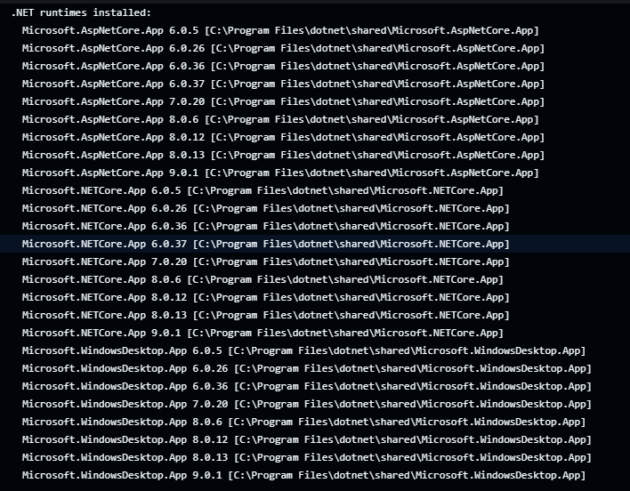
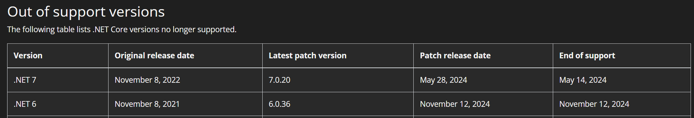

Recently I had a pipeline for the source code to [Essential C#](essentialcsharp.com) suddenly start failing due to some failing unit tests - oddly enough because the `Microsoft.NETCore.App.Ref` NuGet package wasn't found, specifically version 6.0.37. Seems like an mild enough issue, just need to update the package - however knowing the unit test that had failed, this proved a bit more interesting. I knew that the test class - our [compiler assert class](https://github.com/IntelliTect/EssentialCSharp/blob/30964ce86883effd9a2a2cc86315a8d52784e40a/src/Shared/Tests/CompilerAssert.cs) dynamically pulls the appropriate `Microsoft.NETCore.App.Ref` NuGet package based on the runtime that is executing the code.

The test that was failing was a `CompilerAssert` test that is a bit of a meta test - it runs some of our code and verifies that the expected C# Compiler warnings/errors are present and not others. This is a great test to have - as it helps us ensure that the code we are providing in the book is up to date with the current C# compiler warnings and errors.

What stood out about this test is that it was only failing on windows in our GitHub actions pipeline. Running `dotnet --info` on the windows runner showed that the .net runtime `6.0.37` was in fact installed.

Digging further, the .net support policy for .net 6 (<https://dotnet.microsoft.com/en-us/platform/support/policy/dotnet-core#lifecycle>) clearly shows that .net 6.0 ended support on November 12, 2024, and that the last patch was `6.0.36`. This was a bit of a head scratcher - how was the `6.0.37` package being pulled in? It also was not available on the .net downloads page (<https://dotnet.microsoft.com/download/dotnet/6.0>) - so where was it coming from, why was it only failing on windows, and wherever it was coming from, why is there not an associated .NuGet package?

Next step in the puzzle is to try and figure out where the .net runtime is coming from. Looking at the GitHub action runner images; knowing that we use `windows-latest` as the selected runner image, at this point in time, this points to Windows Server 2022 as seen in the [GitHub actions runner documentation](https://github.com/actions/runner-images/tree/db5e0167f47feefd6c8e0ac4908d4110bd1a6c64?tab=readme-ov-file#available-images).

This allowed me to find the final piece - which is hidden in this Azure Compute Blog post about the [.net 6.0 getting extended support on windows server through Azure Marketplace](https://techcommunity.microsoft.com/blog/azurecompute/breaking-change-for-window-server-2022-image-users-with-net-6/4262423). While .net 6.0 has ended support, on only Windows Server 2022 (another specific point) the .net 6.0 runtime has been extended to be supported through the Azure Marketplace until May 13, 2025. This is why the .net 6.0.37 runtime was available on the windows runner, but not on the .net downloads page - and also why the .NuGet package was not available, as it was not a public release.

I ended up patching this with [pr 798](https://github.com/IntelliTect/EssentialCSharp/pull/798) by pinning the version of the NuGet package to `6.0.36` in the `CompilerAssert` test when it sees the .net 6.0 runtime since we know that we won't be getting any newer NuGet packages. I could have also resolved this by moving off of Windows Server 2022, but I typically like to stay with the current supported versions, and Windows Server 2025 is still in beta, but maybe soon. This was a bit of a band-aid, but it allowed the pipeline to pass and I expect to soon drop support for .net 6.0 all together soon as we generally only support the currently supported versions of .net.
